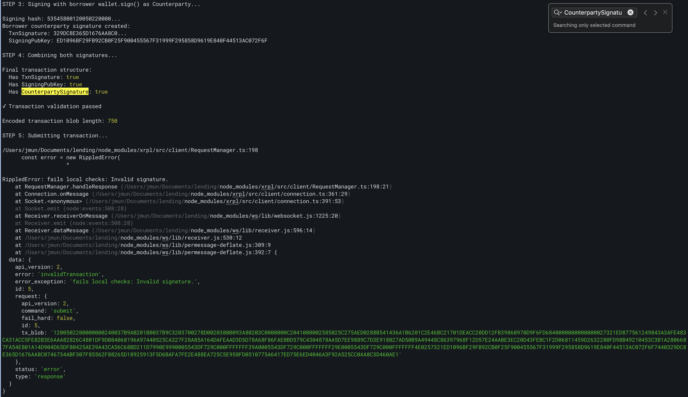

# XRPL Lending Protocol Examples

This project contains TypeScript examples for working with XRPL lending transactions, specifically demonstrating local signing of multi-party LoanSet transactions.

## Project Structure

### Core Files

- **`lending_setup.ts`** - Initial setup script that:
  - Creates and funds test wallets (loan broker, borrower, depositor, credential issuer)
  - Issues MPT tokens
  - Sets up credentials and permissioned domains
  - Creates vaults and loan brokers
  - Generates two sample loans using server-side signing
  - Outputs configuration to `lendingSetup.json`

- **`local_signing_example.ts`** - Demonstrates local signing approach:
  - Loads configuration from `lendingSetup.json`
  - Creates an unsigned LoanSet transaction
  - Signs with loan broker using `wallet.sign()`
  - Attempts to sign with borrower as CounterpartySignature using local signing
  - Submits the multi-signed transaction

## Usage

### 1. Setup

First, run the setup script to initialize wallets and resources:

```bash
npx tsx lending_setup.ts
```

This creates `lendingSetup.json` with all necessary account information.

### 2. Run Local Signing Example

```bash
npx tsx local_signing_example.ts
```

## Known Issue: Invalid Signature

⚠️ **The local signing approach for CounterpartySignature currently fails with "Invalid signature" error.**

### Problem

When attempting to sign a LoanSet transaction locally with `wallet.sign()` for the CounterpartySignature field:

1. ✅ Loan broker signs the transaction successfully with `wallet.sign()`
2. ✅ Transaction encodes and validates locally
3. ❌ **Submission fails with "Invalid signature" error**



### CounterpartySignature Field Structure

According to XRPL specification, `CounterpartySignature` is an inner object that can contain:

| Field Name | JSON Type | Required? | Description |
|------------|-----------|-----------|-------------|
| `SigningPubKey` | String | No | The public key used to verify the validity of the signature |
| `TxnSignature` | String | No | The signature over all signing fields |
| `Signers` | Array | No | An array of transaction signatures from the counterparty (for multi-sig) |

Our implementation correctly creates the structure with `SigningPubKey` and `TxnSignature` fields, but the signature itself is invalid.

### Root Cause

The `CounterpartySignature` field in LoanSet transactions requires special handling that `wallet.sign()` with low-level signing functions (`ripple-keypairs.sign()` + `ripple-binary-codec.encodeForSigning()`) does not properly support.

The current approach:
```typescript
// Remove main signature temporarily
delete transaction.TxnSignature
delete transaction.SigningPubKey

// Sign the modified transaction
const hash = encodeForSigning(transaction)
const signature = sign(hash, borrower.privateKey)

// Combine both signatures
finalTx = {
  ...originalTx,
  CounterpartySignature: {
    TxnSignature: signature,
    SigningPubKey: borrower.publicKey
  }
}
```

This produces a structurally valid transaction (correct field names and types) but with an invalid CounterpartySignature value.

**Key Observation:** The structure is correct - we're creating an object with `SigningPubKey` (String/STBlob) and `TxnSignature` (String/STBlob) fields as specified. However, the signature value itself is being rejected by the ledger, indicating the signing hash or method differs from what the server uses.

### Working Alternative

Using the server's sign command with `signature_target: 'CounterpartySignature'` works correctly (see `lending_setup.ts` lines 282-299):

```typescript
const loanBrokerSig = await client.request({
  command: 'sign',
  tx_json: loanSetTx,
  secret: loanBroker.seed
})

const borrowerSig = await client.request({
  command: 'sign',
  tx_json: loanBrokerSig.result.tx_json,
  secret: borrower.seed,
  signature_target: 'CounterpartySignature'
})
```

### Investigation Needed

- How does the server compute CounterpartySignature differently from standard signatures?
- Is there a different signing hash or encoding required?
- Can this be replicated with local signing, or is server-side signing required?

## Development

### Type Checking

```bash
npx tsc --noEmit
```

### Dependencies

- `xrpl` - XRPL JavaScript library
- `ripple-keypairs` - Low-level signing functions
- `ripple-binary-codec` - Transaction encoding/decoding
- `tsx` - TypeScript execution
- `@types/node` - Node.js type definitions
